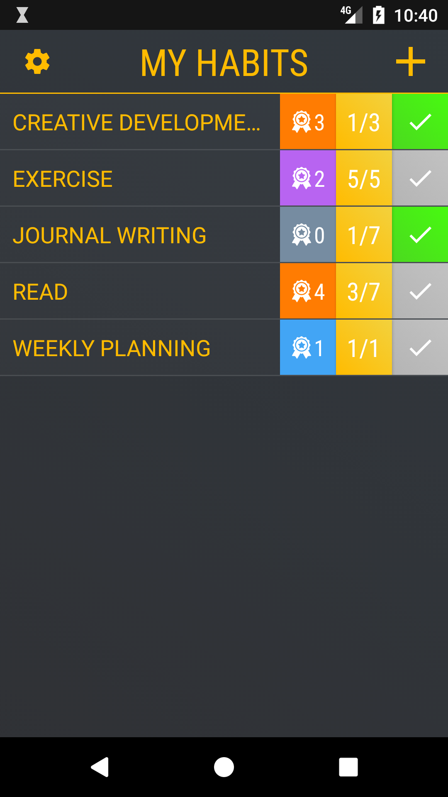

# habitual
A habit tracker app for android.

The app lets you create habits, set weekly goals, and track how many weeks in a row you've completed your habits. 
By the second week you will already begin to see a difference in your productivity and performance. 
Improve your productivity, self-awareness and overall lifestyle by incorporating powerful habits into your daily routine.

Designed using Android Studio. 

Link to Application on Google Play:https://play.google.com/store/apps/details?id=com.accentsoftware.habitual

